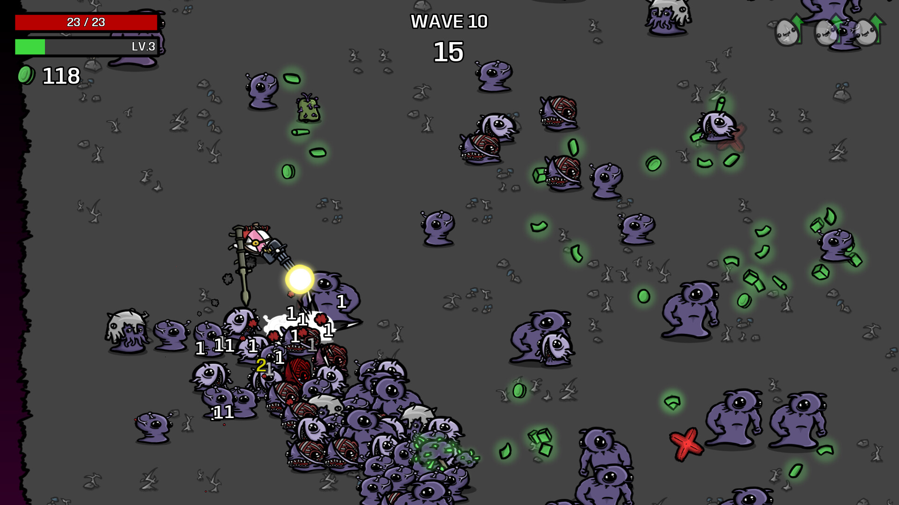

[](https://github.com/5tefan543/uibk_cpp_project/actions/workflows/ci-linux.yml)
[](https://github.com/5tefan543/uibk_cpp_project/actions/workflows/ci-windows.yml)
[](https://codecov.io/gh/5tefan543/uibk_cpp_project)

## Roguelike Specification

The goal of this project is to implement an **arena-survival [Roguelike](https://en.wikipedia.org/wiki/Roguelike) inspired by [Brotato](https://brotato.wiki.spellsandguns.com/Brotato_Wiki)**.


*source: https://store.steampowered.com/app/1942280/Brotato/*

The player controls a character fighting against continuously spawning enemies in a confined arena. Gameplay is organized into **waves**, which are grouped into **stages** consisting of five waves each. In each wave the player must survive enemy attacks while collecting items such as experience points or healing potions. As the game progresses, the difficulty increases through stronger enemies and higher spawn rates in later waves and stages, culminating in a **boss fight** at the end of each stage. After completing a stage, the player can spend collected experience points in the **progression store** to unlock weapons, abilities, or upgrades before continuing with the next stage. The game state can be saved and the game exited while the player is in the progression store, allowing the run to be continued later at the same stage. If the player saves and exits during a stage using the **pause menu**, the current stage is saved but the player will restart at **wave 1 of that stage** when loading the game. If the player dies, the progression is reset and a new run begins at **stage 1, wave 1**.

### Goals (11 Points)
- (1) infinitely progressing stages, each:
    - consisting of 5 waves
    - with its own tone (sprites, music, enemies, etc)
    - a boss at the end (every 5th wave)
    - scaling difficulty (e.g. hp, damage, more enemies, etc)
- (1) basic movement
    - running left / right / up / down;
    - item pickup (xp, healing potions)
- (1) save / load game state after each stage
- (2) one or more advanced movement mechanics
    - dashing
    - advanced abilities with cooldowns (e.g. emergency defensive ability)
    - needs to be unlocked / upgraded during progression
- (2) main combat
    - melee and/or ranged
    - hitting enemies
    - getting hit by enemies
    - aiming (with mouse)
- (2) enemies
    - attack the player character as it gets in range
    - variants with melee attacks
    - variants with ranged attacks
    - bosses are capable of using different attacks
    - spawning mechanism (waves)
- (2) menus
    - main menu
        - high score (across game restarts)
        - new game
        - load game
        - exit
    - pause menu
        - shows player stats
        - continue
        - go to main menu -> reset to stage X wave 1
    - game over
        - player dies -> reset to stage 1 wave 1
    - progression store
        - trade xp with weapons / abilities / upgrades

## Development Setup

### Prerequisites

Make sure the following tools are installed:

- [CMake](https://cmake.org/download/): a cross-platform build system generator.
- [VCPKG](https://github.com/Microsoft/vcpkg): a C++ library manager. In order to install and use VCPKG with cmake and Visual Studio Code, follow this [guide](https://learn.microsoft.com/en-us/vcpkg/get_started/get-started-vscode?pivots=shell-bash).
- [Python](https://www.python.org/downloads/) & [pipx](https://pipx.pypa.io/stable/): for managing Python packages (e.g. pre-commit).

### Pre-commit Hooks

We use [.clang-format](.clang-format) to enforce consistent code formatting.

Install the hook:

```bash
pipx install pre-commit
pre-commit install
```

The hook automatically formats code before every commit.


## Build & Run

### Configure the project with CMake presets:

```bash
cmake --preset debug
cmake --preset release
```

### Build the project with CMake presets:

```bash
cmake --build --preset debug
cmake --build --preset release
```

### Run the application:

```bash
./build/debug/myapp
./build/release/myapp
```


### Running Tests

```bash
ctest --preset debug
ctest --preset release
```


## Project Structure

```
apps/       application entry points
cmake/      cmake helper files
images/     documentation images
include/    public headers
src/        game source code
tests/      unit tests
```
